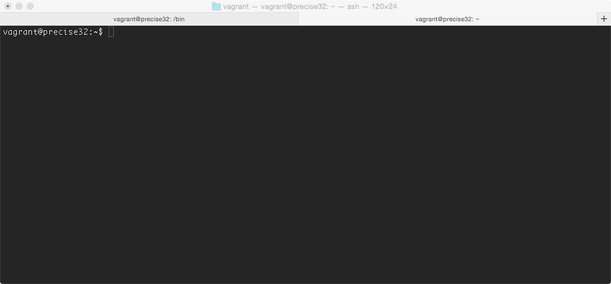

# Unix tour

Se supone que antes de este tour se tienen algunos conceptos básicos de comandos unix ```ls, cp, mv, ps,```.

Vamos a utilizar [vagrant](http://docs.vagrantup.com/v2/getting-started/index.html) para instalarlo en nuestro sistema operativo y no tocar nuestro propio sistema. Vagrant os pedirá que instaléis también [VirtualBox](https://www.virtualbox.org/wiki/Downloads). 

Una vez instalado con estos tres commandos, tendréis virtualizada e instalada una máquina con Ubuntu y os encontraréis dentro de su consola con el nombre de usuario ```vagrant```. 

```
vagrant init hashicorp/precise32
vagrant up
vagrant ssh
```


# Usuarios

+ ```whoami``` : Con este comando sabremos el usuario con el que estamos conectado, en este caso ```vagrant```. Aunque también lo podemos saber viendo el nombre que muestra la consola (como en la imagen anterior) antes de la ```@```.

Pero es que como en cualquier sistema operativo, existen otros usuarios, podemos crearlos, podemos cambiar, ... Esos usuarios se guardan en un fichero especial que podemos visualizar usando ```cat /etc/passwd```. Obtendremos entonces algo como esto: 

```
messagebus:x:102:105::/var/run/dbus:/bin/false
ntp:x:103:108::/home/ntp:/bin/false
sshd:x:104:65534::/var/run/sshd:/usr/sbin/nologin
vagrant:x:1000:1000:vagrant,,,:/home/vagrant:/bin/bash
vboxadd:x:999:1::/var/run/vboxadd:/bin/false
statd:x:105:65534::/var/lib/nfs:/bin/false
```

**¿Qué es esto?** ```Cada linea``` es un usuario. Y en cada linea el símbolo ```:``` separa diferentes propiedades de cada usuario que se explican genial en [este documento](http://www.cyberciti.biz/faq/understanding-etcpasswd-file-format/). 


# Otros

+ [Organización Ficheros UNIX](http://en.wikipedia.org/wiki/Unix_filesystem)
